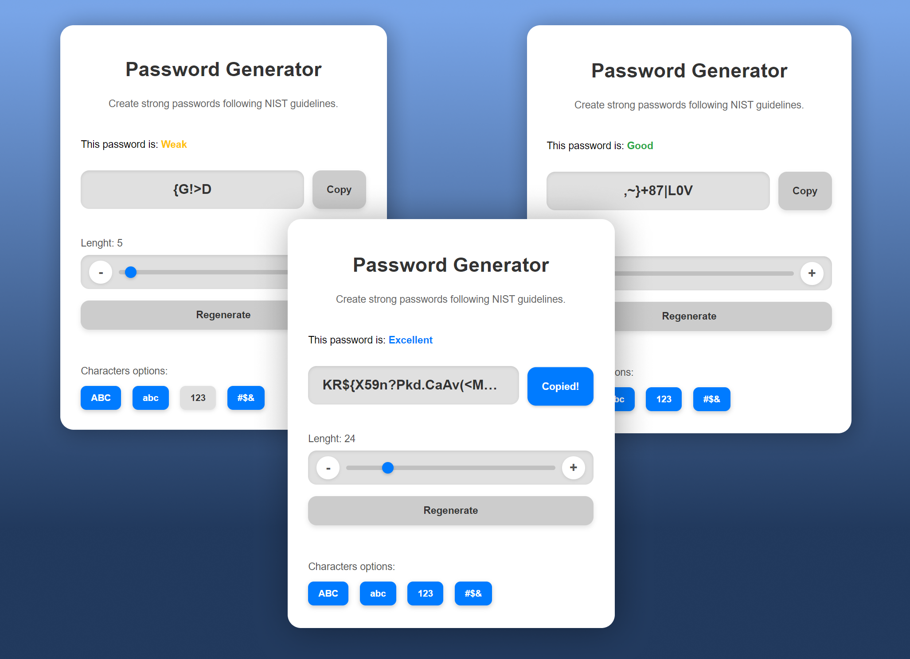
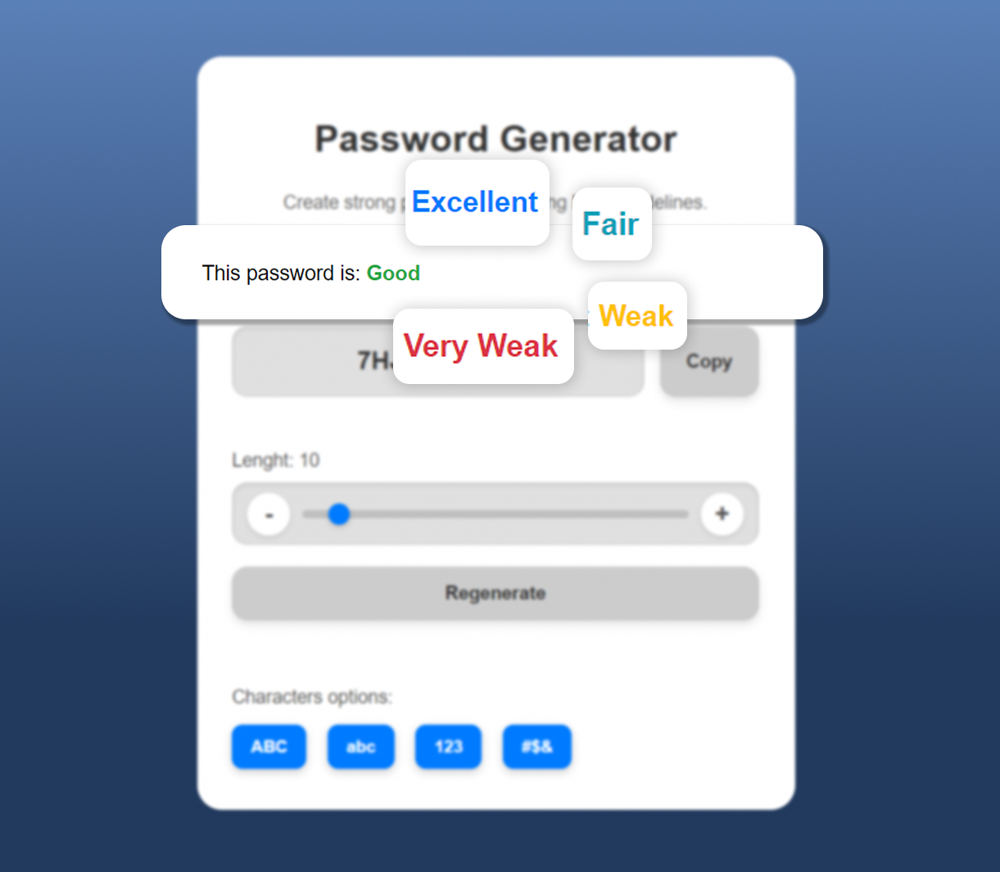

# nist-password-generator
NIST-compliant, secure web password generator with real-time strength evaluation.

## Screenshots

# FAQs
# Does this generator store my passwords or my data?
No. This generator operates entirely in your browser and does not store any generated passwords or user data on external servers. Once you close the page, the password does not persist.

# Is this online generator safe to use?
Yes, it is safe. The password generation process occurs directly in your browser, which means your passwords are never sent to a server.

# What is NIST and why is it relevant to passwords?
NIST (National Institute of Standards and Technology) is a U.S. government agency that develops technical standards and guidelines, including those for cybersecurity. Their password recommendations are widely recognized and considered best practices for creating strong and secure passwords, helping to protect against common attacks.

# How does this generator comply with NIST recommendations?
This password generator incorporates key principles from NIST guidelines, such as the recommendation to use long passwords (minimum 15 characters), the inclusion of a variety of character types (uppercase, lowercase, numbers, symbols), and the promotion of entropy to generate hard-to-guess passwords.

# What do the terms "Very Weak", "Weak", "Good", and "Excellent" mean?
These terms indicate the password's resistance level against brute-force or dictionary attacks. "Excellent" means the password is very difficult to crack; "Very Weak" indicates it's easily vulnerable. It is always recommended to aim for a "Good" or "Excellent" rating.

# Why is a minimum of 15 characters recommended?
NIST recommendations and security experts suggest that length is one of the most critical factors for password strength. From 15 characters onwards, the number of possible combinations becomes so immense that modern brute-force attacks would take thousands or millions of years to decipher it.
